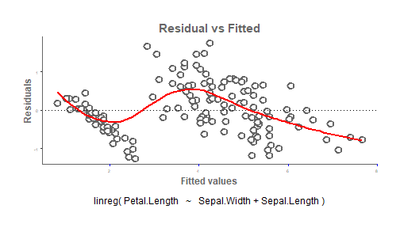
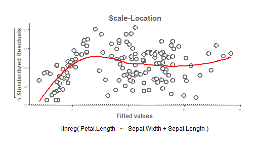

**RCourseLab4** is entitled for the students who have completed lab3. This is an advanced assigment of R. This package contains several methods of linear regression model including **vignette** manual.We are using linear algebra to create the most basic functionality in the R package. It has a R script based on RC class  where we first defined the fields and then methods. The methods which implemented for calculating linear regression model is defined later.This package contains few things :

- A Method RC class is used here named as linreg(). 
- About six methods implemented for linear regression model.
- Used Roxygen skeleton and vignette for documentation.

## linreg() Class:

The function we created here is called **linreg()** and have the two arguments formula and data. The function returns an object with of class linreg. The class is implemented as Referrence class using **setRefClass()**. Outside the class we created object **linreg_mod** for returning the results. This class accepts several arguments as lists in **fields** and **methods** classes. In fields class we defined the necessary parameters we need for our class and their type. Where in methods class we defined our required calculations.

## Calculations using ordinary least squares: 

### Regressions coefficients:  
Regressions coefficient using linear algebra
$$\hat{\beta} = (\mathbf{X}^\top \mathbf{X})^{-1}(\mathbf{X}^\top \mathbf{y})$$

### The fitted values:
Fitted values using linear algebra    
              $$ \hat{y}= X\hat{\beta} $$
              
### The residuals:
Residuals using linear algebra 
        $$\hat{e}= y - \hat{y} = X\hat{\beta} $$

### The degrees of freedom:
The degrees of freedom using linear algebra 
        $$ df = n - p $$
        where n is the number of observations and p is the number of parameters in the model

### The residual variance:
The residual variance: using linear algebra 
        $$ \hat{\sigma}^2 = \frac{\mathbf{e}^\top \mathbf{e}}{df}$$
   
### The variance of the regression coefficients:        
The variance of the regression coefficients
  $$ \hat{Var}(\hat{\beta}) = \hat{\sigma}^2({\mathbf{X}^\top \mathbf{X}})^{-1} $$

###The t-values for each coefficient:
The t-values for each coefficient
        $$ t_\beta= \frac{\hat{\beta}}{\sqrt{{Var}(\hat{\beta})}} $$

## Methods:
###linreg_mod$print()
It prints out the coefficients and coefficient names.

```r
knitr::opts_chunk$set(error = FALSE)

print = function() {
     
                      cat("\n","Call:","\n",
                          paste("linreg(", "formula = ", formula[2]," ", formula[1], " ", 
                                formula[3],", ", "data = ", parsedata, ")",sep = "", 
                                collapse = "\n" ),"\n","Coefficients:","\n",
                          paste(row.names(beta), sep = "  ", collapse ="  " ),"\n",
                          format(round(beta,2), justify = "centre",width = 10))
                    }
linreg_mod <- RCourseLab4:::linreg$new(Petal.Length~Sepal.Width+Sepal.Length,data=iris)
linreg_mod$print()
```

```
## 
##  Call: 
##  linreg(formula = Petal.Length ~ Sepal.Width + Sepal.Length, data = iris) 
##  Coefficients: 
##  (Intercept)  Sepal.Width  Sepal.Length 
##       -2.52      -1.34       1.78
```


###linreg_mod$plot()
## Figures of two plot are shown below.

```
## $`Residual vs Fitted`
```



```
## 
## $`Scale Location`
```



###linreg_mod$resid()
resid() returns the vector of residuals of e.

```r
knitr::opts_chunk$set(error = TRUE)
resid = function(){
                     cat("Vector of Residuals:","\n")
                     return(as.vector(round(ebar, 2)))
           }
linreg_mod <- RCourseLab4:::linreg$new(Petal.Length~Sepal.Width+Sepal.Length,data=iris)
linreg_mod$resid()
```

```
## Vector of Residuals:
```

```
##   [1] -0.45 -0.76 -0.24  0.01 -0.13 -0.14  0.31 -0.30 -0.01 -0.53 -0.61
##  [12]  0.15 -0.58  0.01 -1.22 -0.21 -0.54 -0.45 -0.81  0.06 -0.81 -0.08
##  [23]  0.18 -0.41  0.45 -0.74 -0.20 -0.52 -0.76  0.06 -0.25 -1.01  0.28
##  [34] -0.22 -0.53 -0.87 -1.26  0.04  0.03 -0.48 -0.37 -1.09  0.30 -0.07
##  [45]  0.46 -0.58  0.16  0.04 -0.43 -0.54 -0.92 -0.06 -0.68 -0.16 -0.67
##  [56]  0.65  0.46  0.34 -0.71  0.81 -0.18  0.26 -1.18  0.28  0.06 -0.82
##  [67]  1.10 -0.06 -1.04 -0.17  1.13 -0.56 -0.41  0.14 -0.66 -0.78 -1.00
##  [78] -0.36  0.25 -0.62 -0.23 -0.33 -0.26  0.59  1.45  0.92 -0.52 -1.18
##  [89]  0.70  0.11  0.64  0.31 -0.29  0.03  0.40  0.62  0.49 -0.30 -0.18
## [100]  0.25  1.76  0.94 -0.17  0.82  0.80 -0.35  1.67 -0.26 -0.23  0.66
## [111]  0.37  0.08 -0.03  0.75  1.07  0.74  0.50  0.64 -0.77 -0.18  0.26
## [122]  1.23 -0.70 -0.15  0.75  0.02  0.06  0.61  0.51 -0.44 -0.77 -0.02
## [133]  0.51  0.19  0.77 -1.03  1.49  0.81  0.69 -0.18  0.38 -0.48  0.94
## [144]  0.63  0.75 -0.16 -0.31  0.20  1.47  1.16
```


###linreg_mod$pred()
pred() returns the predicted values of ybar.

```r
knitr::opts_chunk$set(error = TRUE)
pred =function(){
                     cat("Predicted values or fitted values:","\n")
                     return(as.vector(round(ybar, 2)))
          }
linreg_mod <- RCourseLab4:::linreg$new(Petal.Length~Sepal.Width+Sepal.Length,data=iris)
linreg_mod$pred()
```

```
## Predicted values or fitted values:
```

```
##   [1] 1.85 2.16 1.54 1.49 1.53 1.84 1.09 1.80 1.41 2.03 2.11 1.45 1.98 1.09
##  [15] 2.42 1.71 1.84 1.85 2.51 1.44 2.51 1.58 0.82 2.11 1.45 2.34 1.80 2.02
##  [29] 2.16 1.54 1.85 2.51 1.22 1.62 2.03 2.07 2.56 1.36 1.27 1.98 1.67 2.39
##  [43] 1.00 1.67 1.44 1.98 1.44 1.36 1.93 1.94 5.62 4.56 5.58 4.16 5.27 3.85
##  [57] 4.24 2.96 5.31 3.09 3.68 3.94 5.18 4.42 3.54 5.22 3.40 4.16 5.54 4.07
##  [71] 3.67 4.56 5.31 4.56 4.96 5.18 5.80 5.36 4.25 4.12 4.03 4.03 4.16 4.51
##  [85] 3.05 3.58 5.22 5.58 3.40 3.89 3.76 4.29 4.29 3.27 3.80 3.58 3.71 4.60
##  [99] 3.18 3.85 4.24 4.16 6.07 4.78 5.00 6.95 2.83 6.56 6.03 5.44 4.73 5.22
## [113] 5.53 4.25 4.03 4.56 5.00 6.06 7.67 5.18 5.44 3.67 7.40 5.05 4.95 5.98
## [127] 4.74 4.29 5.09 6.24 6.87 6.42 5.09 4.91 4.83 7.13 4.11 4.69 4.11 5.58
## [141] 5.22 5.58 4.16 5.27 4.95 5.36 5.31 5.00 3.93 3.94
```

###linreg_mod$coef()
coef() returns the coefficients as a named vector


```r
knitr::opts_chunk$set(error = TRUE)
coef = function() {
                     cat("Regressions coefficients:","\n\n")
                     return(as.vector(round(beta,2)))
          }
linreg_mod <- RCourseLab4:::linreg$new(Petal.Length~Sepal.Width+Sepal.Length,data=iris)
linreg_mod$coef()
```

```
## Regressions coefficients:
```

```
## [1] -2.52 -1.34  1.78
```

###linreg_mod$summary()
summary() computes and returns a list of summary statistics of the fitted linear model given in object, using the components (list elements).


```
## 
##  Call:
## 
##  linreg(formula = Petal.Length ~ Sepal.Width + Sepal.Length, data = iris) 
## 
##  Coefficients:
## 
##              Estimate Std. Error t value Pr(>|t|) 
##  (Intercept)    -2.52       0.56   -4.48      *** 
##  Sepal.Width    -1.34       0.12  -10.94      *** 
## Sepal.Length     1.78       0.06   27.57      *** 
## 
##  Residual standard error: 0.65 on 147 degrees of freedom
```


##Roxygen Description files:
###Package documentation : **RCourseLab4.Rd**
This file includes the detail description of how package works , who worked for it and so on.

###Function documentation : **linreg-class.Rd**
This file contains the description of class file , fields, method, examples, references and return statements.

###Vignettes documentation : **lab4.Rmd**
This is about how the whole package is made of and how to read it and implement it.
 
##Install **RCourseLab4** package for future reference:
devtools::install_github("farhashazmeen/lab4")

```r
devtools::install_github("farhashazmeen/lab4")
```

## Limitations:
Unable to add geographical theme on ggplot and estimation of QR decomposition.


